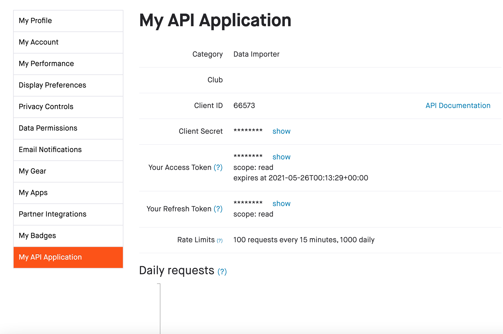

## This is a neat data source to be using.
```{r setup, include=FALSE}
knitr::opts_chunk$set(echo = TRUE)
```

## Let's bring in your Strava data!

This blog post will guide you the somewhat complicated process of bringing in your own personal Strava data for use within the RStudio environment. To begin, you will need to have two things: an active Strava account and an RStudio .Rmd ready to use.

First, visit <https://www.strava.com/settings/api>. If you are not logged in, it will prompt you to enter your login credentials. Once you are logged in, you will be taken to the Strava page to create an API Application.

<center>

{width="40%"}

</center>

You will need to enter some basic information to complete this process.

First, come up with an **application name**. This can be anything you like, but keep it simple.

Next, choose an **application type**. For our example, we selected "data importer" because that is our primary purpose here.

The **club** field can be left empty.

Enter whatever **website** you like in the relevant field. Your github repo or Strava profile page would work fine, as no one besides you will likely be looking at this information.

The **application description** can be whatever you like.

For the **authorization callback domain**, enter *developers.strava.com.*

When you are done, you should have it filled out something like this:

<center>

{width="40%"}

</center>

When you click on Create, it will ask you to update your app icon. You can add any image file you like, and then it will take you to a screen listing your information.

<center>

{width="40%"}

</center>

For the next step, you will need to show your **Client Secret**, which will display a long alphanumeric string that is unique to you. This allows RStudio to talk to Strava for the initial handshake, verifying your identity and allowing RStudio to pull your data.

In your .Rmd, add the following lines of code:

    # ```{r}
    # 
    # library(rStrava)
    # 
    # library(plyr)
    # 
    # app_name <- "ENTER_YOUR_APP_NAME_HERE "
    # 
    # app_client_id <- "ENTER_YOUR_CLIENT_ID_HERE"
    # 
    # app_secret <- "ENTER_YOUR_CLIENT_SECRET_HERE"
    # 
    # #create the authentication token (only once)
    # 
    # stoken <- httr::config(token = strava_oauth(app_name, app_client_id, app_secret,
    # 
    # app_scope="activity:read_all", cache=TRUE))
    # 
    # #retrieve local token
    # 
    # stoken <- httr::config(token = readRDS('.httr-oauth')[[1]])
    # 
    # filename_raw <- "./data_raw.Rda"
    # 
    # filename_df <- "./data_df.Rda"
    # 
    # if (file.exists(filename_df)) {
    # 
    # cat("….. download last week")
    # 
    # load("./data_df.Rda")
    # 
    # # create empty data frame with same amount of columns as existing data,
    # 
    # # otherwise column mismatch may occur
    # 
    # df_empty <- df_activities[0,]
    # 
    # # define last date minus 1 week for corrections
    # 
    # last_date <- as.Date(max(df_activities$start_date))-7
    # 
    # # get new activities and place in data frame
    # 
    # new_activities <- get_activity_list(stoken, after = last_date)
    # 
    # df_new_activities <- compile_activities(new_activities, units="metric")
    # 
    # df_new_activities <- rbind.fill(df_empty,df_new_activities)
    # 
    # # replace existing records with updated ones, ignore the warnings
    # 
    # suppressWarnings(df_activities[df_activities$id %in% df_new_activities$id, ] <- df_new_activities)
    # 
    # # combine dataframes
    # 
    # df_activities <- rbind.fill(df_activities,df_new_activities)
    # 
    # df_activities <- unique(df_activities)
    # 
    # }
    # 
    # {
    # 
    # cat("….. Downloading from 2004, this takes some time")
    # 
    # last_date <- as.Date("2004-01-01")
    # 
    # activities <- get_activity_list(stoken, after = last_date)
    # 
    # df_activities <- compile_activities(activities, units="metric")
    # 
    # }
    # 
    # # store dataframe
    # 
    # save(df_activities, file="data_df.Rda")

    ```

Some things to note: be sure to enter your own **Application Name**, **Client ID**, and **Client Secret** in the correct spots. After running that code chunk, you should connect to the Strava website for authorization.

Check both boxes, and then click Authorize to link Strava with your data.

After the Authorization is complete, you will have a file called *stoken* appear in your working environment. Once that file is in place, you can comment out the two lines of code directly under the spot where you entered your Client Secret. You will see a little note there that it only needs to happen once:

\#create the authentication token (only once)

delete this line it's just me checking gitkraken
